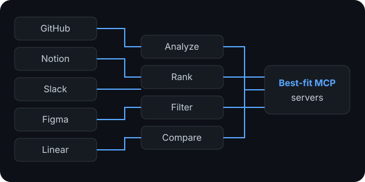
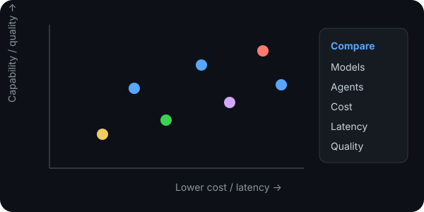
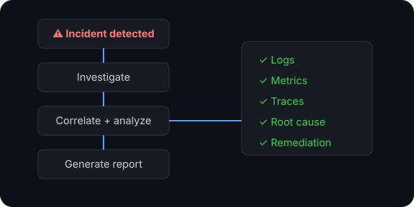
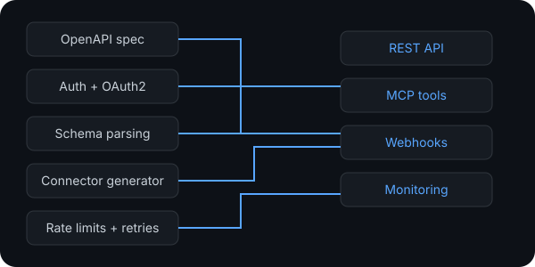

# Hi, I'm Gabe 👋

### AI & Backend Engineer

📍 Berlin, Germany&emsp;&emsp;&emsp;&emsp;&emsp;&emsp;💼 Open to freelance work&emsp;&emsp;&emsp;&emsp;&emsp;&emsp;🌐 Open-source collaboration

> **Building AI applications and Python backend systems — from prototype to production.**

  &emsp;
  &emsp;
  &emsp;
  &emsp;
  &emsp;
  &emsp;
  &emsp;
  

  &emsp;&emsp;
  &emsp;&emsp;
  

  <a href="https://heygabe.pages.dev">🌐 Portfolio</a>&emsp;&emsp;&emsp;&emsp;&emsp;&emsp;&emsp;&emsp;
  <a href="https://mail.google.com/mail/?view=cm&fs=1&to=heygabe.dev@gmail.com&su=CV%20request&body=Hi%20Gabe%2C%0A%0AI%20came%20across%20your%20GitHub%20profile%20and%20would%20be%20interested%20in%20taking%20a%20look%20at%20your%20CV.%0A%0ACould%20you%20send%20me%20the%20latest%20version%20when%20you%20have%20a%20chance%3F%0A%0ABest%2C">📄 CV on request</a>&emsp;&emsp;&emsp;&emsp;&emsp;&emsp;&emsp;&emsp;
  <a href="https://mail.google.com/mail/?view=cm&fs=1&to=heygabe.dev@gmail.com&su=Getting%20in%20touch&body=Hi%20Gabe%2C%0A%0AI%20came%20across%20your%20GitHub%20profile%20and%20wanted%20to%20get%20in%20touch.%0A%0AI%27d%20like%20to%20chat%20about%3A%0A%0A%5Badd%20a%20few%20details%20here%5D%0A%0ABest%2C">📬 Email</a>

---

## Projects

<a href="https://github.com/heygabedev?tab=repositories">View all repositories →</a>

<table>
<tr>
<td width="25%" valign="top">

### MCP server sorter

Discovers, evaluates and ranks MCP servers for different use cases using LLM-based analysis. Helps developers find the right tools and integrations faster.

`Python` · `FastAPI` · `MCP`

</td>
<td width="25%" valign="top">

### Agent tradeoff visualizer

Interactive tool for comparing LLMs and agent architectures across cost, latency, capability and reliability tradeoffs.

`React` · `TypeScript` · `Python`

</td>
<td width="25%" valign="top">

### Autonomous Incident Investigation agent

Multi-agent system that correlates logs, metrics and traces, reconstructs incidents, identifies likely root causes and produces a remediation plan.

`Python` · `LangGraph` · `AWS`

</td>
<td width="25%" valign="top">

### ConnectorForge

OpenAPI-to-production connector platform that turns third-party APIs into normalized REST/MCP integrations with auth, rate limiting, retries, webhooks and monitoring.

`Python` · `FastAPI` · `TypeScript`

</td>
</tr>
</table>

## Additional private projects

🔒 **Selected private work — details available on request.**

<table width="100%">
<tr>
<td width="50%" valign="top">

<strong>🏛️ German Regulatory & Market Intelligence Platform</strong>  
Automated research platform that gathers live market data, continuously updates German federal and Bundesland regulations, and turns them into structured business intelligence and decision support.

</td>
<td width="50%" valign="top">

<strong>📱 Soma — Commerce, Booking & Client Platform</strong>  
Full-stack web and mobile product for selling services, scheduling bookings, processing payments and managing clients, with cloud deployment.

</td>
</tr>
<tr>
<td width="50%" valign="top">

<strong>📊 SignalDesk — Lead & Hiring Intelligence Platform</strong>  
Built for a real recruiting workflow. Monitors job boards and company signals, gathers and scores leads from multiple sources, and supports targeted outreach and tracking.

</td>
<td width="50%" valign="top">

<strong>👹 Token Goblin</strong>  
LLM token-usage and cost-analysis tool for tracking model usage across projects, surfacing spend patterns, budgets and optimization opportunities.

</td>
</tr>
<tr>
<td width="50%" valign="top">

<strong>🧠 Neurovault</strong>  
Multi-agent engineering system that routes feature work through planning, implementation, QA/security and documentation agents, with reusable pipelines, evaluation tooling and observability.

</td>
<td width="50%" valign="top">

<strong>👁️ Product Image Classification System</strong>  
Transfer-learning computer vision pipeline for automatically categorizing product images, covering dataset preparation, augmentation, training, evaluation and inference, achieving <strong>95% accuracy</strong> on a custom dataset.

</td>
</tr>
</table>

<strong>...and more</strong> — additional AI, backend, data and automation projects available on request.

---

### Let's talk

If you're working on something interesting in **AI or backend engineering**, or just want to swap ideas, feel free to [reach out](https://mail.google.com/mail/?view=cm&fs=1&to=heygabe.dev@gmail.com&su=Hey%20Gabe%20%F0%9F%91%8B&body=Hey%20Gabe%2C%0A%0ACame%20across%20your%20GitHub%20and%20thought%20I%27d%20reach%20out.%0A%0AI%27m%20working%20on%20%2F%20thinking%20about%20something%20that%20might%20be%20interesting%20to%20chat%20about%3A%0A%0A%5Bwhat%27s%20on%20your%20mind%5D%0A%0ACheers%2C). I'm always happy to chat about projects, opportunities, or tricky technical problems.
